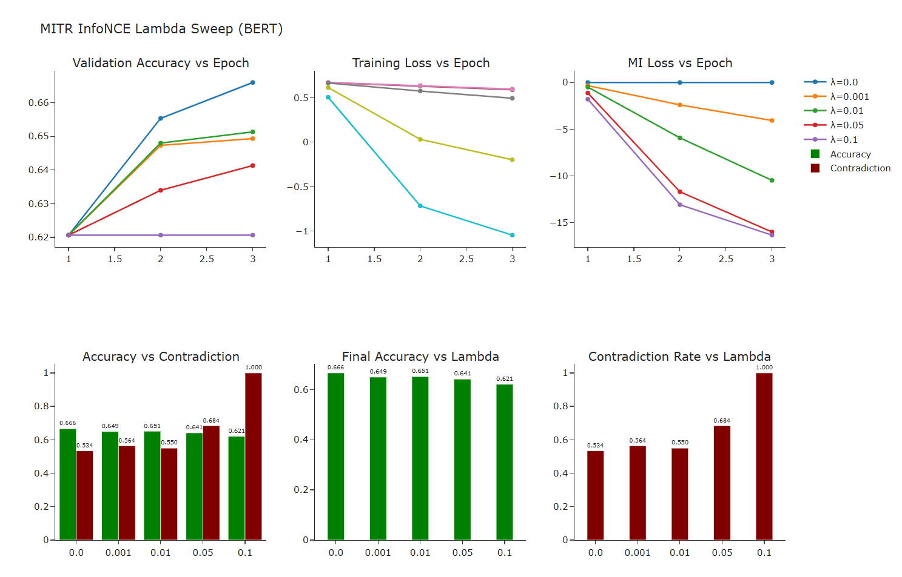

# MITR

---

## Part A: Critical Review

### Weakness 1: Incomplete & Contradictory BERT Results

| **Question** | **Answer** |
|---|---|
| **What is the problem?** | Across both tested paradigms - CKA and Cosine, BERT contradiction rates worsen (3.2-4%) with only a marginal gain in accuracy. This discrepancy in BERT results is a major hurdle to the broad claim that MI regularisation tactics can improve Logical Reasoning ability. Despite InfoNCE emerging as the best strategy from both accuracy and consistency perspectives, `mitr_bert_roberta_boolq.ipynb` clubs InfoNCE with CLUB and skips both.. The fact that the best performing strategy on DistilBERT - InfoNCE, which improved both accuracy and consistency is absent on the BERT-Roberta test makes for an incomplete evaluation. As such, no MI strategy consistently rules.|
| **Why would a reviewer reject?** | While the repo mentions that the InfoNCE eval was out of scope, it makes for a missing data point and therefore inconclusive results at best and the negative result on BERT only serves to point out that this method perhaps does not generalise well - the claim that the NSP paradigm might be the perpetrator is merely a hypothesis and remains unjustified.|
| **How would you fix it?** | • Run InfoNCE to fill the gap in results - the contrastive learning technique might offer different results • Lambda sweep - The experiments use 1 single lambda - 0.01. Different backbones and strategies might require different MI regularisation weighting. If BERT’s arch does not meld well with MI regularisation, perhaps it might benefit from lower strength. • Test on more models with different training paradigms (ie, add to the bert+roberta+distilbert set) - other strategies in the architectures might be confounders if the aim is to prove NSP interference though • Ablate NSP directly • Not all layers are built the same - freeze the initial layers that likely focus on syntax and let MI affect semantic learning in the later layers |

### Weakness 2: No Statistical Significance / Multi-Seed

| **Question** | **Answer** |
|---|---|
| **What is the problem?** | All results and analysis are based on runs with seed fixed at 42. Currently the best accuracy gain in the DistilBERT experiment is on InfoNCE at +0.20% (0.698 → 0.700) and Contradiction reduction: ~1.8% relative. While the absolute numbers and margins do go up in the BERT and Roberta experiments, they are still well within noise levels. There’s no confidence intervals / std dev or significance testing.|
| **Why would a reviewer reject?** | None of the results reported are statistically significant. A robust experimental setup will have multiple seed runs and statistical significance metrics reported. As such these results remain inconclusive and cannot be used as evidence in any direction.|
| **How would you fix it?** | • Run 3–5 seeds per configuration • Report McNemar's test and mean ± std ranges |

### Weakness 3: BoolQ Doesn't Generalise to Logical Reasoning

| **Question** | **Answer** |
|---|---|
| **What is the problem?** | BoolQ with binary results is a weak indicator of logical reasoning. The experiment only tests negation pairs (“X” vs “not X”). There’s more to logical reasoning than a static wikipedia bool dataset - there are no reported results for measurements like multi-hop reasoning and entailments and syllogisms. |
| **Why would a reviewer reject?** | While the paper claims to investigate the effect of MI regularisation on logical reasoning, one bool dataset is not indicative of logical reasoning ability. The contradiction metric with simple negations is also highly gameable. |
| **How would you fix it?** | • Merge accuracy and consistency into a single *true accuracy* metric (consistently correct answers) • Evaluate on entailment and multi-hop reasoning datasets to substantiate the "logical reasoning" claim |

---

## Part B: Workshop Selection

### BlackboxNLP 2026
The Ninth Workshop on Analyzing and Interpreting Neural Networks for NLP
Co-located with EMNLP 2026 in Budapest, Hungary on October 28th, 2026

**Pitch:** 

This work directly aligns with BlackboxNLP’s focus on understanding how neural networks represent and process information. MITR introduces a controlled intervention—mutual information regularization between transformer layers—and evaluates how altering inter-layer dependencies affects reasoning consistency. Rather than proposing a new architecture, we probe how training objectives reshape internal representations and downstream behavior. Our results reveal a clear mismatch between optimization and function: although InfoNCE improves training loss, it systematically degrades logical consistency on BERT, even causing complete failure at higher λ. By showing that these effects are backbone-dependent and not recoverable through tuning, this work contributes to a mechanistic understanding of how representation geometry and layer interactions govern reasoning. This directly fits the workshop’s emphasis on interpretability, representation analysis, and understanding failure modes in NLP systems.

**Related Papers:**

1. *"Fine-Tuned Transformers Show Clusters of Similar Representations Across Layers"* — Phang, Liu, Bowman, BlackboxNLP 2021
   This work shows that transformer layers often learn redundant representations; MITR explicitly targets this phenomenon by enforcing inter-layer diversity and studies its impact on reasoning.

2. *"Investigating ReLoRA: Effects on the Learning Dynamics of Small Language Models"* - Weiss et al., BlackboxNLP 2025
   This paper studies how training interventions alter optimisation dynamics and downstream behaviour; similarly, our work shows that modifying the training objective via MI regularisation can improve optimisation (loss) while simultaneously degrading reasoning consistency, highlighting a mismatch between training dynamics and functional outcomes.

---

## Part C: Experimental Design

### Experiment 1: InfoNCE on BERT & RoBERTa (Multi-Seed)

| **Question** | **Answer** |
|---|---|
| **Hypothesis** | InfoNCE on BERT might produce better results than baseline or the no-parameter CKA or cosine strategies due to the contrastive learning technique. Consistent improvements with larger margins across seeds might concur with the fact that InfoNCE can favourably leverage the 10-pair consecutive layers of the BERT architecture. |
| **Expected Result** | Full positive result (like in DistilBERT) - Contradiction rates decrease and accuracy improves across seeds. Or accuracy improves past baseline and the contradiction rates remain unaffected. |
| **What a Negative Result Means** | **Partial Positive Results**  • Only accuracy improves, while contradiction worsens - this will be in line with the CKA and Cosine results and would mean further investigation is needed - to produce conclusive results indicating that the backbone ie, the BERT architecture is affecting performance, ablation studies and more mechanistic evidence is required.  • Contradiction improves while accuracy worsens - Logical consistency would have seemingly improved. Further analysis will be required to determine whether this improvement is meaningful - ie, analysis of consistency paired with accuracy -> true accuracy •  **Negative result**  Neither accuracy nor consistency improve - this will mean that InfoNCE is a worse strategy than both CKA and Cosine - post ablation studies, we might be able to conclude that this particular MI regularisation scheme is untenable for BERT. |
| **Estimated GPU Hours (Colab T4)** | Per my implementation - 1 run with 3 epochs on 6k train set takes ~15-20 mins. A full implementation with 5 epoch will take ~30-40 mins per model. Considering only InfoNCE for BERT and Roberta, this means 1.5 hrs for 1 seed. Considering a minimum of 3 seed runs -> 4.5 hrs on a colab T4. |
| **How This Changes the Central Claim** | A statistically significant (or at the least robust) result with InfoNCE will add valuable data points. Currently, the paper has disparate evaluations, in that the DistilBERT results are completely ignored in the experiment design of the BERT and Roberta experiments. 

This experiment will help provide a full report with comparable data points so that we can potentially show generalisation of methods across models. A positive result on InfoNCE will offer a consistent best strategy which will take the discussion from - MITR is backbone specific  - to - MITR InfoNCE offers consistent improvements on logical reasoning. |

### Experiment 2: Lambda Sweep

| **Question** | **Answer** |
|---|---|
| **Hypothesis** | Different backbones behave differently under MI regularisation. Altering the MI weight param, specifically, lowering it in the case of BERT might produce a more balanced result. The premise being that there might be different optimal lambdas for different strategies and models and that different magnitudes of MI weights might be preferable for different backbones. |
| **Expected Result** | The repo claims that poor results on BERT might be backbone based - ie, that MI regularisation might be clashing with BERT's MLM+NSP strategy. If the poor results on BERT were indeed caused by unnecessary interference with the pre-training paradigm, lowering lambda from the original - lambda < 0.01 ought to produce improved accuracy and consistency ie, performance will peak at lambda ~ 0.001 and will continue to degrade on either side. In general, different backbones will show improvement with different lambda selections.|
| **What a Negative Result Means** | λ variation has no effect → 0.01 is the optimum. Increasing λ degrades performance → confirms the original setting is best. Neither outcome produces a BERT-friendly configuration. |
| **Estimated GPU Hours (Colab T4)** | Per my implementation - 1 run with 3 epochs on 6k train set takes ~15-20 mins. A full implementation with 5 epoch will take ~30-40 mins per model. Considering 3 strategies - CKA, cosine and InfoNCE, for BERT, Roberta and DistilBERT, this means ~6 hrs for 1 seed. Considering a minimum of 3 seed runs if the hypothesis proves viable -> 18 hrs on a colab T4. |
| **How This Changes the Central Claim** | A positive result on varying lambda will prove that different backbones behave differently. This will help strengthen the BERT results. This will also help introduce an empirical insight that regularization strength influences compatibility and performance across backbones, instead of a vague statement about performance being backbone-dependent.|

---

## Part D: Implementation

### InfoNCE on BERT with Lambda Sweep

### Premise
1. Q1: Does InfoNCE improve results on BERT? 
- InfoNCE is the missing model in the BERT+Roberta eval - Considering that InfoNCE was the best performer in the DistilBERT experiment, running the same on BERT will add comparable datapoints and the contrastive learning paradigm might improve BERT MI reg results.
2. Q2: Is there an optimal lambda for InfoNCE + BERT that improves reasoning and flips the previously contradictory results on CKA and Cosine?
- Varying lambda on the BERT experiment will help test the hypothesis that the different backbone strategy in BERT(NSP) might be clashing with MI and that lowering the MI weight on BERT might produce better results or that there is an optimal lambda at which each strategy performs best on each model. Testing the best MI strategy InfoNCE (as of DistilBERT) will help study improvements over original lambda for comparison and also the effect of varying lambda on BERT.
3. This code can be used separately for InfoNCE on Roberta for more result data points and also to run more lambda sweeps on the different MI strategies and models.

### Experimental Setup
- 1 strategy (infonce) x 5 lambdas (0, 0.001, 0.01, 0.05, 0.1) x 1 model (BERT)
- Scoped down to 3 epochs (instead of 5) and train:6000 instead of 8000 with 1500 val and 500 contra.
- Each run (3 epochs) takes approx 15-20mins on T4 -> 5 runs ~ 1.5-2 hrs

### Interpretation
1. Lambda == 0 is the baseline setup - with weight 0  negating the MI effect
2. Lambda == 0.01 will correspond to the InfoNCE implementation that would have been compared with the original CKA and Cosine (if not for the consideration that this experiment has been scoped down). Nevertheless, it is still comparable against the case 1 baseline result.
3. Lambda < 0.01 will correspond to the second hypothesis, wherein, lowering the MI regularisation weight is expected to reduce interference with the BERT pretraining architecture and improve performance. Therefore lambda == 0.001 ought to produce better results (compared to cases 1 and 2).
4. In general, if MI with InfoNCE were a viable paradigm on BERT, performance will peak at the optimal lambda (this could be 0.01 but is expected to be <) and degrade on either side.

**Results**

**Discussion:**

A λ sweep reveals that InfoNCE does not admit an optimal operating regime on BERT. At λ = 0.01, InfoNCE shows a −1.47% drop in accuracy and a +1.60% increase in contradiction relative to baseline, consistent with the largely negative results observed for CKA and Cosine. While λ = 0.01 performs best among the tested values, it still fails to match baseline. Lowering regularisation strength to λ = 0.001 does not recover performance, though it is less harmful than larger values. As λ increases further, both accuracy and consistency degrade sharply, with λ = 0.1 resulting in complete logical collapse. Overall, these results indicate that InfoNCE-based inter-layer decorrelation is not a tunable inductive bias for BERT — it is fundamentally misaligned with its pretrained representation structure.

| **Lambda** | **Accuracy** | **Acc Δ** | **Contra** | **Contra Δ** |
|---|---|---|---|---|
| 0.0 | 0.6660 | — | 0.5340 | — |
| 0.001 | 0.6493 | -1.67% | 0.5640 | -3.00% |
| 0.01 | 0.6513 | -1.47% | 0.5500 | -1.60% |
| 0.05 | 0.6413 | -2.47% | 0.6840 | -15.00% |
| 0.1 | 0.6207 | -4.53% | 1.0000 | -46.60% |

---

## Part E: Abstract

Large language models often achieve high accuracy while exhibiting logical inconsistencies, such as producing identical answers to contradictory queries. We propose MITR, a mutual-information-based regularization framework that enforces inter-layer diversity in transformer representations to improve logical consistency. Our central finding is that the effectiveness of MITR is strongly backbone-dependent: while InfoNCE dominates on DistilBERT, improving both accuracy and contradiction rate, all MI strategies (CKA, Cosine, and InfoNCE) fail to improve performance on BERT. A λ sweep with InfoNCE on BERT-base shows no optimal operating regime: even the best-performing configuration (λ = 0.01) reduces accuracy by 1.47% and increases contradiction rate by 1.60% relative to the baseline, while larger values lead to severe degradation, culminating in complete logical collapse (100% contradiction) at λ = 0.1. These results suggest that MI-based inter-layer decorrelation can act as a useful inductive bias for lighter architectures, but is fundamentally misaligned with BERT’s pretrained representation structure, highlighting the importance of backbone-aware regularization for improving reasoning consistency.